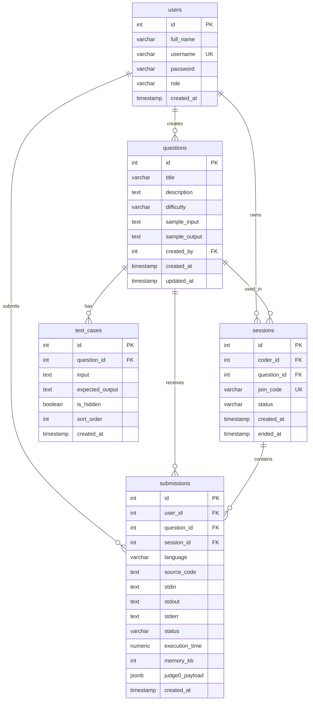

# Database Design Document

Project: Online Code Editor tương tự LeetCode.

Database: PostgreSQL.

## 1. Scope

Database phục vụ MVP **Admin + Coder first**:

1. Lưu user và role.
2. Lưu question bank.
3. Lưu visible/hidden test cases.
4. Lưu submission history và code snapshot.
5. Giữ sẵn bảng `sessions` cho Phase 2 realtime Reviewer/Viewer.

## 2. ERD



## 3. Tables

### 3.1 users

Lưu tài khoản đăng nhập và phân quyền.

| Column | Type | Constraint | Description |
| --- | --- | --- | --- |
| `id` | `SERIAL` | Primary key | ID user |
| `full_name` | `VARCHAR(120)` | Nullable | Tên hiển thị |
| `username` | `VARCHAR(50)` | Unique, not null | Tên đăng nhập |
| `password` | `VARCHAR(255)` | Not null | Mật khẩu đã hash |
| `role` | `VARCHAR(20)` | Not null, default `coder` | Role: `admin`, `coder`, `viewer` |
| `created_at` | `TIMESTAMP` | Default current timestamp | Thời điểm tạo |

Role `viewer` được giữ cho Phase 2.

### 3.2 questions

Lưu ngân hàng câu hỏi lập trình.

| Column | Type | Constraint | Description |
| --- | --- | --- | --- |
| `id` | `SERIAL` | Primary key | ID question |
| `title` | `VARCHAR(200)` | Not null | Tên câu hỏi |
| `description` | `TEXT` | Not null | Nội dung đề |
| `difficulty` | `VARCHAR(20)` | Not null, default `easy` | `easy`, `medium`, `hard` |
| `sample_input` | `TEXT` | Nullable | Input ví dụ |
| `sample_output` | `TEXT` | Nullable | Output ví dụ |
| `created_by` | `INTEGER` | FK users(id), nullable | Admin tạo câu hỏi |
| `created_at` | `TIMESTAMP` | Default current timestamp | Thời điểm tạo |
| `updated_at` | `TIMESTAMP` | Default current timestamp | Thời điểm cập nhật |

### 3.3 test_cases

Lưu test case của từng question.

| Column | Type | Constraint | Description |
| --- | --- | --- | --- |
| `id` | `SERIAL` | Primary key | ID test case |
| `question_id` | `INTEGER` | FK questions(id), not null | Question sở hữu test case |
| `input` | `TEXT` | Nullable | Input truyền vào chương trình |
| `expected_output` | `TEXT` | Not null | Output đúng |
| `is_hidden` | `BOOLEAN` | Not null, default `true` | Có ẩn với Coder không |
| `sort_order` | `INTEGER` | Not null, default `0` | Thứ tự chạy/hiển thị |
| `created_at` | `TIMESTAMP` | Default current timestamp | Thời điểm tạo |

Security note: `expected_output` của hidden test case chỉ Admin được xem.

### 3.4 submissions

Lưu mỗi lần Coder/Admin chạy hoặc nộp code.

| Column | Type | Constraint | Description |
| --- | --- | --- | --- |
| `id` | `SERIAL` | Primary key | ID submission |
| `user_id` | `INTEGER` | FK users(id), not null | Người chạy code |
| `question_id` | `INTEGER` | FK questions(id), nullable | Câu hỏi liên quan |
| `session_id` | `INTEGER` | FK sessions(id), nullable | Session Phase 2 |
| `language` | `VARCHAR(50)` | Not null | Ngôn ngữ lập trình |
| `source_code` | `TEXT` | Not null | Snapshot source code |
| `stdin` | `TEXT` | Nullable | Input tùy chỉnh |
| `stdout` | `TEXT` | Nullable | Output chuẩn |
| `stderr` | `TEXT` | Nullable | Lỗi runtime/compile |
| `status` | `VARCHAR(50)` | Not null | `queued`, `accepted`, `wrong_answer`, `runtime_error`, ... |
| `execution_time` | `NUMERIC(10,3)` | Nullable | Thời gian chạy |
| `memory_kb` | `INTEGER` | Nullable | Bộ nhớ sử dụng |
| `judge0_payload` | `JSONB` | Nullable | Payload/response phục vụ debug |
| `created_at` | `TIMESTAMP` | Default current timestamp | Thời điểm tạo |

Denormalization note: `source_code`, `stdin`, `stdout`, `stderr`, `status`, `execution_time`, `memory_kb` được lưu trực tiếp để giữ snapshot lịch sử.

### 3.5 sessions

Lưu session realtime cho Phase 2.

| Column | Type | Constraint | Description |
| --- | --- | --- | --- |
| `id` | `SERIAL` | Primary key | ID session |
| `coder_id` | `INTEGER` | FK users(id), not null | Coder sở hữu session |
| `question_id` | `INTEGER` | FK questions(id), nullable | Question dùng trong session |
| `join_code` | `VARCHAR(32)` | Unique, not null | Mã join cho Reviewer/Viewer |
| `status` | `VARCHAR(20)` | Not null, default `active` | `active`, `ended` |
| `created_at` | `TIMESTAMP` | Default current timestamp | Thời điểm tạo |
| `ended_at` | `TIMESTAMP` | Nullable | Thời điểm kết thúc |

## 4. Relationships

| Relationship | Type | Description |
| --- | --- | --- |
| `users -> questions` | One-to-many | Một Admin có thể tạo nhiều questions |
| `users -> submissions` | One-to-many | Một user có nhiều submissions |
| `questions -> test_cases` | One-to-many | Một question có nhiều test cases |
| `questions -> submissions` | One-to-many | Một question nhận nhiều submissions |
| `users -> sessions` | One-to-many | Một Coder có nhiều sessions Phase 2 |
| `questions -> sessions` | One-to-many | Một question có thể dùng trong nhiều sessions |
| `sessions -> submissions` | One-to-many | Một session có thể chứa nhiều submissions |

## 5. Indexes

| Index | Type | Purpose |
| --- | --- | --- |
| `users_username_unique` | Unique | Login nhanh và tránh trùng username |
| `users_role_idx` | Normal | Admin lọc user theo role |
| `questions_created_by_idx` | Normal | Truy vấn question theo Admin tạo |
| `questions_difficulty_idx` | Normal | Lọc question theo difficulty |
| `test_cases_question_id_idx` | Normal | Lấy test cases theo question |
| `sessions_join_code_unique` | Unique | Phase 2 Reviewer join session |
| `sessions_coder_status_idx` | Composite | Coder tìm session active |
| `submissions_user_created_idx` | Composite | Coder xem history của mình |
| `submissions_question_created_idx` | Composite | Admin lọc submissions theo question |
| `submissions_session_created_idx` | Composite | Phase 2 xem submissions theo session |
| `submissions_status_idx` | Normal | Thống kê theo status |

## 6. SQL Schema

Schema hiện được khởi tạo trong `backend/src/config/db.js`.

```sql
CREATE TABLE IF NOT EXISTS users (
  id SERIAL PRIMARY KEY,
  full_name VARCHAR(120),
  username VARCHAR(50) NOT NULL,
  password VARCHAR(255) NOT NULL,
  role VARCHAR(20) NOT NULL DEFAULT 'coder',
  created_at TIMESTAMP DEFAULT CURRENT_TIMESTAMP,
  CONSTRAINT users_role_check CHECK (role IN ('admin', 'coder', 'viewer'))
);

CREATE UNIQUE INDEX IF NOT EXISTS users_username_unique ON users(username);
CREATE INDEX IF NOT EXISTS users_role_idx ON users(role);

CREATE TABLE IF NOT EXISTS questions (
  id SERIAL PRIMARY KEY,
  title VARCHAR(200) NOT NULL,
  description TEXT NOT NULL,
  difficulty VARCHAR(20) NOT NULL DEFAULT 'easy',
  sample_input TEXT,
  sample_output TEXT,
  created_by INTEGER REFERENCES users(id) ON DELETE SET NULL,
  created_at TIMESTAMP DEFAULT CURRENT_TIMESTAMP,
  updated_at TIMESTAMP DEFAULT CURRENT_TIMESTAMP,
  CONSTRAINT questions_difficulty_check CHECK (difficulty IN ('easy', 'medium', 'hard'))
);

CREATE INDEX IF NOT EXISTS questions_created_by_idx ON questions(created_by);
CREATE INDEX IF NOT EXISTS questions_difficulty_idx ON questions(difficulty);

CREATE TABLE IF NOT EXISTS test_cases (
  id SERIAL PRIMARY KEY,
  question_id INTEGER NOT NULL REFERENCES questions(id) ON DELETE CASCADE,
  input TEXT,
  expected_output TEXT NOT NULL,
  is_hidden BOOLEAN NOT NULL DEFAULT true,
  sort_order INTEGER NOT NULL DEFAULT 0,
  created_at TIMESTAMP DEFAULT CURRENT_TIMESTAMP
);

CREATE INDEX IF NOT EXISTS test_cases_question_id_idx ON test_cases(question_id);

CREATE TABLE IF NOT EXISTS sessions (
  id SERIAL PRIMARY KEY,
  coder_id INTEGER NOT NULL REFERENCES users(id) ON DELETE CASCADE,
  question_id INTEGER REFERENCES questions(id) ON DELETE SET NULL,
  join_code VARCHAR(32) NOT NULL,
  status VARCHAR(20) NOT NULL DEFAULT 'active',
  created_at TIMESTAMP DEFAULT CURRENT_TIMESTAMP,
  ended_at TIMESTAMP,
  CONSTRAINT sessions_status_check CHECK (status IN ('active', 'ended'))
);

CREATE UNIQUE INDEX IF NOT EXISTS sessions_join_code_unique ON sessions(join_code);
CREATE INDEX IF NOT EXISTS sessions_coder_status_idx ON sessions(coder_id, status);

CREATE TABLE IF NOT EXISTS submissions (
  id SERIAL PRIMARY KEY,
  user_id INTEGER NOT NULL REFERENCES users(id) ON DELETE CASCADE,
  question_id INTEGER REFERENCES questions(id) ON DELETE SET NULL,
  session_id INTEGER REFERENCES sessions(id) ON DELETE SET NULL,
  language VARCHAR(50) NOT NULL,
  source_code TEXT NOT NULL,
  stdin TEXT,
  stdout TEXT,
  stderr TEXT,
  status VARCHAR(50) NOT NULL,
  execution_time NUMERIC(10, 3),
  memory_kb INTEGER,
  judge0_payload JSONB,
  created_at TIMESTAMP DEFAULT CURRENT_TIMESTAMP
);

CREATE INDEX IF NOT EXISTS submissions_user_created_idx ON submissions(user_id, created_at DESC);
CREATE INDEX IF NOT EXISTS submissions_question_created_idx ON submissions(question_id, created_at DESC);
CREATE INDEX IF NOT EXISTS submissions_session_created_idx ON submissions(session_id, created_at DESC);
CREATE INDEX IF NOT EXISTS submissions_status_idx ON submissions(status);
```

## 7. Security And Data Rules

1. Password phải được hash, không lưu plain text.
2. Role chỉ nhận `admin`, `coder`, `viewer`.
3. Coder không được đọc hidden `expected_output`.
4. Submission phải lưu code snapshot để xem lại lịch sử chính xác.
5. Raw `judge0_payload` phục vụ debug, không nên expose toàn bộ cho Coder.
6. Database query dùng parameterized query với `pg` để giảm rủi ro SQL injection.

## 8. Current Implementation Files

| Purpose | File |
| --- | --- |
| DB initialization | `backend/src/config/db.js` |
| Auth/users data access | `backend/src/modules/auth`, `backend/src/modules/users` |
| Question data access | `backend/src/modules/questions/questions.repository.js` |
| Test case data access | `backend/src/modules/test-cases/test-cases.repository.js` |
| Submission data access | `backend/src/modules/submissions/submissions.repository.js` |
