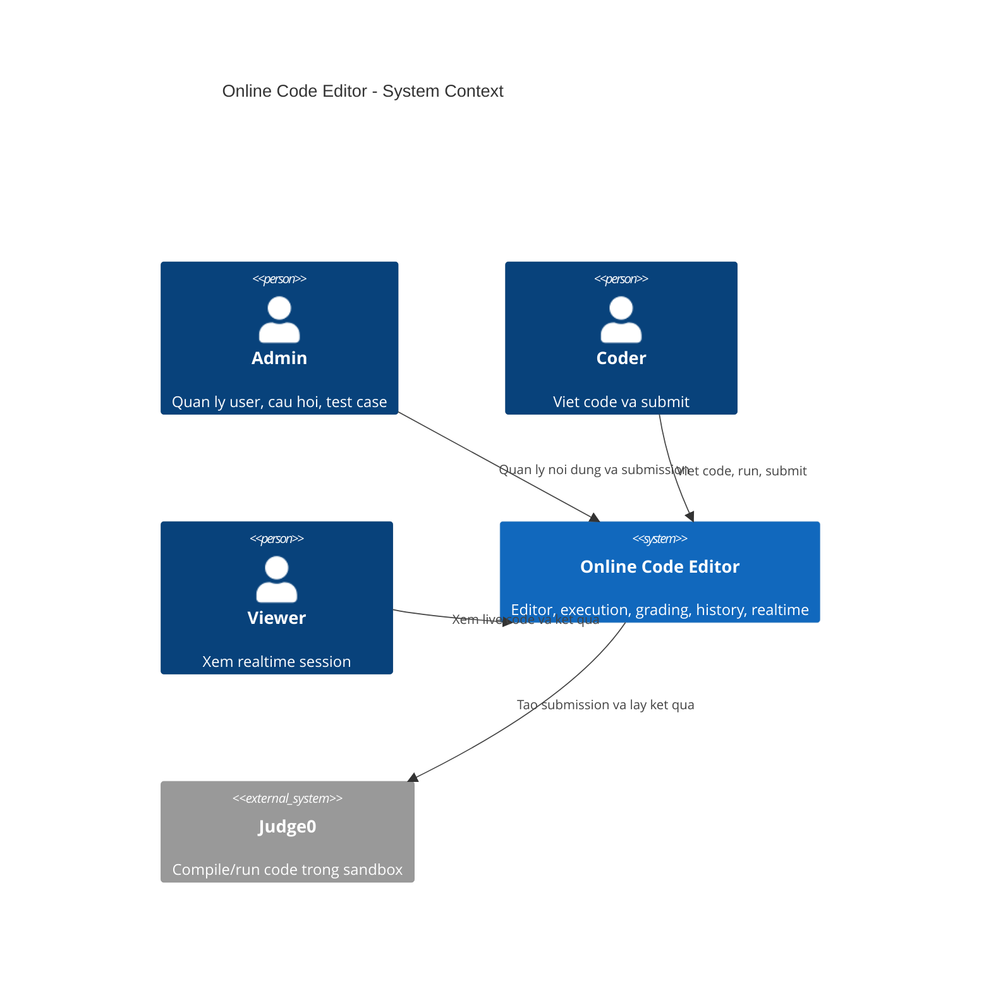
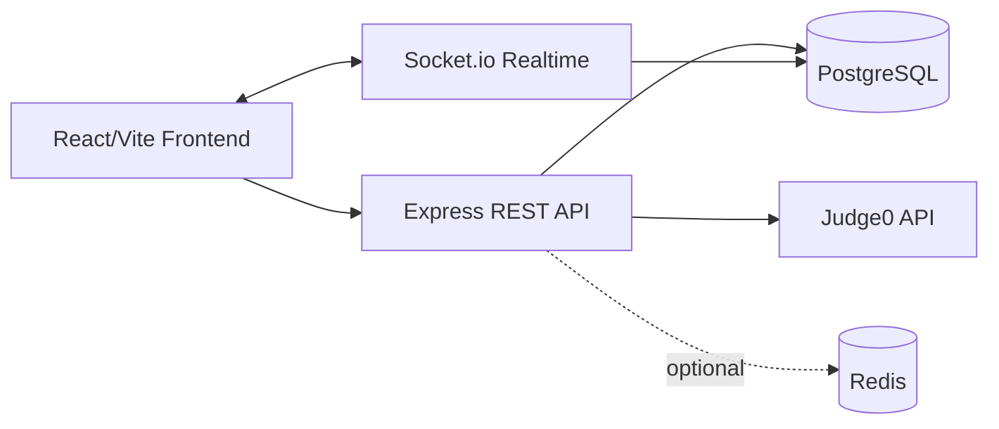
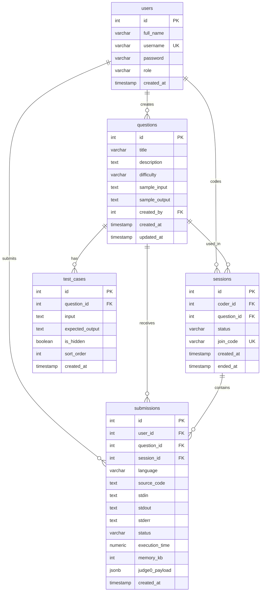
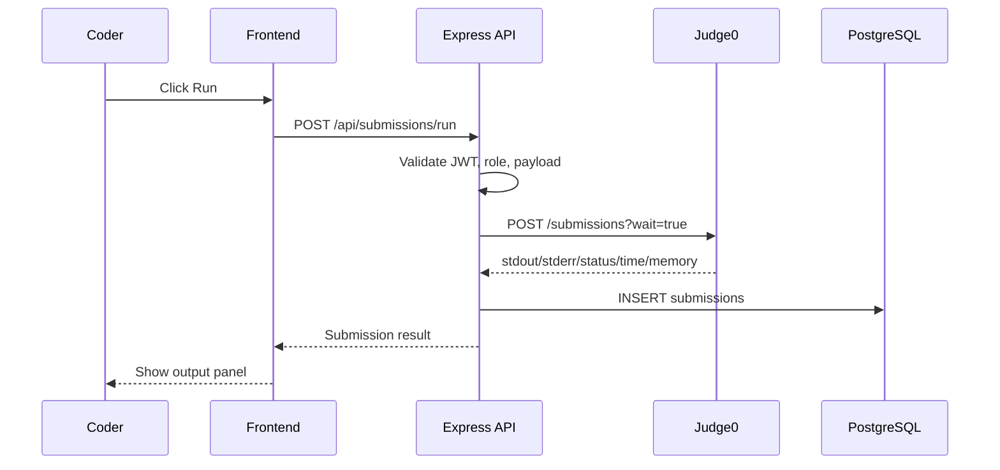
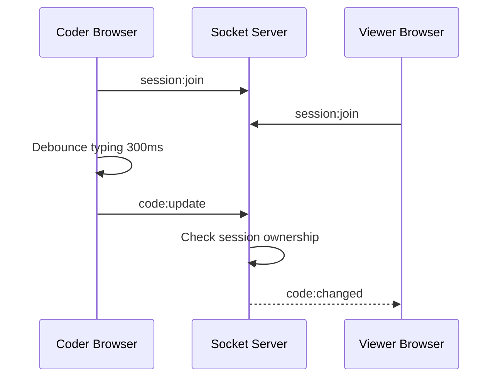

# Online Code Editor Preparation

Tai lieu nay chuan bi project online code editor tu nen hien co cua repo: React/Vite frontend, Express backend, PostgreSQL, JWT auth va Docker Compose.

## 1. Product Scope

### Muc tieu

Xay dung web platform cho phep ung vien viet code online, chay code trong sandbox, luu lich su submission va cho interviewer xem code realtime theo mot chieu.

### MVP bat buoc

1. Auth va RBAC: Admin, Coder, Viewer.
2. Code editor UI: nhap ma nguon, chon ngon ngu, nhap stdin.
3. Code execution: backend goi Judge0 self-hosted, nhan stdout, stderr, time, memory, status.
4. History: moi lan run/submission duoc luu lai.
5. Question/test case: Admin tao cau hoi va test case, Coder submit de cham.
6. Realtime viewer: Coder go code, Viewer xem live trong session.

### Khong lam trong MVP

1. Multi-coder collaborative editing co conflict resolution.
2. Contest ranking phuc tap.
3. Payment, notification email, analytics nang cao.
4. AI code review/autocomplete.

## 2. Recommended Stack

| Layer | Chon | Ly do |
| --- | --- | --- |
| Frontend | React + Vite | Repo da co React/Vite; VS Code la moi truong dung de phat trien source code |
| Backend | Node.js + Express | Repo da co modular 3-layer Express |
| Database | PostgreSQL | Luu user, question, test case, submission, session |
| Realtime | Socket.io | De self-host, de kiem soat 1 chieu Coder -> Viewer |
| Execution | Judge0 self-hosted | Sandbox san, ho tro nhieu ngon ngu |
| Queue/Rate limit | Redis optional | Can khi submission tang hoac can throttle |
| Container | Docker Compose | Phu hop dev/demo va self-host Judge0 |

## 3. Architecture

### C4 Context



### Container View



## 4. Backend Module Plan

Giu dung architecture hien co trong `AGENTS.md`: moi feature nam trong `backend/src/modules/<feature>`.

| Module | Files | Trach nhiem |
| --- | --- | --- |
| `auth` | da co | Register/login/me, JWT |
| `users` | routes/controller/service/repository/schema | Admin quan ly role user |
| `questions` | routes/controller/service/repository/schema | CRUD question |
| `test-cases` | routes/controller/service/repository/schema | CRUD test case theo question |
| `submissions` | routes/controller/service/repository/schema | Run/submit code, luu result |
| `judge0` | service/client/map | Goi Judge0, map language/status |
| `sessions` | routes/controller/service/repository/schema | Tao interview/coding session |
| `realtime` | socket server + auth middleware | Dong bo code Coder -> Viewer |

## 5. Database Design

### ERD



### Index de xuat

| Index | Ly do |
| --- | --- |
| `users(username)` unique | Login nhanh va tranh trung username |
| `users(role)` | Admin filter user theo role |
| `questions(created_by)` | Xem cau hoi theo admin tao |
| `test_cases(question_id)` | Lay test case khi cham bai |
| `submissions(user_id, created_at DESC)` | Coder xem history cua minh |
| `submissions(question_id, created_at DESC)` | Admin xem submission theo cau hoi |
| `sessions(join_code)` unique | Viewer join session bang code |

## 6. API Draft

Base path: `/api`.

### Auth

| Method | Path | Role | Mo ta |
| --- | --- | --- | --- |
| POST | `/register` | public | Tao user Coder mac dinh |
| POST | `/login` | public | Login, tra JWT |
| GET | `/me` | authenticated | Lay user hien tai |

### Users

| Method | Path | Role | Mo ta |
| --- | --- | --- | --- |
| GET | `/users` | Admin | Danh sach user |
| PATCH | `/users/:id/role` | Admin | Doi role |

### Questions

| Method | Path | Role | Mo ta |
| --- | --- | --- | --- |
| GET | `/questions` | authenticated | Danh sach cau hoi |
| GET | `/questions/:id` | authenticated | Chi tiet cau hoi |
| POST | `/questions` | Admin | Tao cau hoi |
| PATCH | `/questions/:id` | Admin | Cap nhat cau hoi |
| DELETE | `/questions/:id` | Admin | Xoa cau hoi |

### Test Cases

| Method | Path | Role | Mo ta |
| --- | --- | --- | --- |
| GET | `/questions/:id/test-cases` | Admin | Xem tat ca test case |
| POST | `/questions/:id/test-cases` | Admin | Tao test case |
| PATCH | `/test-cases/:id` | Admin | Cap nhat test case |
| DELETE | `/test-cases/:id` | Admin | Xoa test case |

### Submissions

| Method | Path | Role | Mo ta |
| --- | --- | --- | --- |
| POST | `/submissions/run` | Coder/Admin | Chay code voi stdin tuy chinh |
| POST | `/submissions/grade` | Coder/Admin | Chay code qua test case cua question |
| GET | `/submissions/me` | Coder/Admin | History cua user hien tai |
| GET | `/submissions` | Admin | Tat ca submission |
| GET | `/submissions/:id` | owner/Admin | Chi tiet submission |

Example body for `/submissions/run`:

```json
{
  "questionId": 1,
  "sessionId": 10,
  "language": "javascript",
  "sourceCode": "console.log('hello')",
  "stdin": ""
}
```

### Sessions

| Method | Path | Role | Mo ta |
| --- | --- | --- | --- |
| POST | `/sessions` | Coder/Admin | Tao coding session |
| GET | `/sessions/:joinCode` | Viewer/Admin/Coder | Lay thong tin session |
| PATCH | `/sessions/:id/end` | Coder/Admin | Ket thuc session |

## 7. Realtime Events

Dung Socket.io namespace `/sessions`.

| Event | Direction | Payload | Ghi chu |
| --- | --- | --- | --- |
| `session:join` | client -> server | `{ joinCode }` | Viewer/Coder join room |
| `code:update` | Coder -> server | `{ sessionId, language, sourceCode }` | Client debounce 300ms |
| `code:changed` | server -> Viewer | `{ sessionId, language, sourceCode, updatedAt }` | Viewer chi xem |
| `submission:result` | server -> room | `{ sessionId, submissionId, status }` | Bao ket qua run moi |
| `session:ended` | server -> room | `{ sessionId }` | Khong nhan update nua |

Can xac thuc socket bang JWT. Server phai check role: chi Coder cua session moi duoc emit `code:update`; Viewer chi duoc receive.

## 8. RBAC Matrix

| Capability | Admin | Coder | Viewer |
| --- | --- | --- | --- |
| Login/register | Yes | Yes | Yes |
| Quan ly role user | Yes | No | No |
| CRUD question | Yes | No | No |
| CRUD test case | Yes | No | No |
| Xem question | Yes | Yes | Yes |
| Run code | Yes | Yes | No |
| Submit de grade | Yes | Yes | No |
| Xem history cua minh | Yes | Yes | No |
| Xem tat ca submission | Yes | No | No |
| Tao session | Yes | Yes | No |
| Xem realtime session | Yes | Yes | Yes |
| Edit realtime session | Yes | Own session only | No |

## 9. Sequence Diagrams

### Run Code



### Realtime Code Sync



## 10. Risk And Edge Cases

| Risk/Edge case | Cach xu ly |
| --- | --- |
| User code infinite loop | Judge0 `cpu_time_limit`, `wall_time_limit`, return TLE |
| Fork bomb/network abuse | Judge0 sandbox config, disable network neu khong can |
| Judge0 down | Health check, timeout, friendly error, khong crash API |
| 20+ submissions cung luc | Queue optional voi Redis/BullMQ, gioi han concurrent request |
| Coder spam typing | Debounce 300ms, server rate limit socket event |
| Hidden test case bi lo | API Coder khong tra `expected_output` cua hidden case |
| Output khac newline/space | Normalize output khi grade: trim trailing whitespace, cau hinh strict neu can |
| Code snapshot lon | MVP luu text trong DB; scale lon thi tach sang object storage |
| Token het han khi socket dang mo | Socket middleware validate khi connect, client reconnect sau login |

## 11. Implementation Roadmap

### Week 3: Analysis

1. Chot scope MVP.
2. Hoan thien requirement, edge case, risk list.
3. Chot stack: Socket.io hay Supabase Realtime.

### Week 4: Design

1. Ve C4 context/container.
2. Chot ERD va index.
3. Tao migration cho role va cac bang moi.

### Week 5: API Contract

1. Viet API spec chi tiet.
2. Viet RBAC middleware.
3. Them docs sequence diagram.

### Week 6-7: MVP Demo

1. Frontend editor page voi code editor UI don gian.
2. Backend `submissions/run` goi Judge0.
3. Luu history va hien output.
4. Socket.io realtime Coder -> Viewer.

### Week 8: Final

1. Case study: isolation, failure, concurrency.
2. Demo script.
3. Final presentation.

## 12. Next Coding Steps In This Repo

Thu tu nen lam:

1. Them cot `role` vao `users`, mac dinh `coder`.
2. Tao middleware `authorizeRoles`.
3. Tao module `questions`.
4. Tao module `test-cases`.
5. Tao module `submissions` voi Judge0 client dang mock/local config truoc.
6. Them frontend route `EditorPage`.
7. Hoan thien code editor UI; co the tich hop editor library o phase sau neu can.
8. Them Socket.io sau khi flow run code on dinh.
