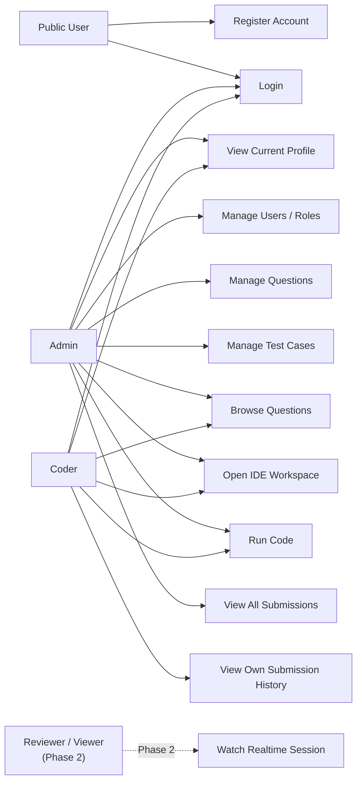

# User Case / Use Case Document

Project: Online Code Editor tương tự LeetCode.

## 1. Scope

MVP hiện tại ưu tiên **Admin + Coder first**.

Reviewer/Viewer realtime được để Phase 2 để tránh làm loãng demo core flow.

## 2. Actors

| Actor | Mô tả |
| --- | --- |
| Public User | Người chưa đăng nhập, có thể đăng ký hoặc đăng nhập |
| Admin | Người quản trị hệ thống, quản lý user, câu hỏi và test case |
| Coder | Người làm bài, chọn câu hỏi, viết code, chạy code và xem lịch sử |
| Reviewer/Viewer | Người xem realtime trong Phase 2, chưa thuộc MVP hiện tại |

## 3. Use Case Diagram



## 4. MVP Use Cases

### UC-01: Register Account

| Item | Description |
| --- | --- |
| Actor | Public User |
| Goal | Tạo tài khoản để sử dụng hệ thống |
| Precondition | Username chưa tồn tại |
| Main flow | User nhập full name, username, password; hệ thống validate; hệ thống tạo user mới role mặc định `coder` |
| Success result | User được tạo thành công |
| Failure cases | Username trùng, thiếu password, dữ liệu không hợp lệ |

### UC-02: Login

| Item | Description |
| --- | --- |
| Actor | Admin, Coder |
| Goal | Đăng nhập và nhận JWT để gọi API protected |
| Precondition | User đã có tài khoản |
| Main flow | User nhập username/password; backend kiểm tra mật khẩu; backend trả access token |
| Success result | Frontend lưu token và tải profile hiện tại |
| Failure cases | Sai username/password, token hết hạn |

### UC-03: Manage Users And Roles

| Item | Description |
| --- | --- |
| Actor | Admin |
| Goal | Quản lý danh sách user và đổi role |
| Precondition | Admin đã đăng nhập |
| Main flow | Admin xem danh sách user; chọn user; đổi role thành `admin`, `coder` hoặc `viewer` |
| Success result | Role user được cập nhật trong database |
| Failure cases | User không tồn tại, role không hợp lệ, user không phải Admin gọi API |

### UC-04: Manage Questions

| Item | Description |
| --- | --- |
| Actor | Admin |
| Goal | Tạo, cập nhật, xóa câu hỏi lập trình |
| Precondition | Admin đã đăng nhập |
| Main flow | Admin nhập title, description, difficulty, sample input/output; backend lưu vào bảng `questions` |
| Success result | Question xuất hiện trong question bank |
| Failure cases | Thiếu title/description, difficulty không hợp lệ, user không phải Admin |

### UC-05: Manage Test Cases

| Item | Description |
| --- | --- |
| Actor | Admin |
| Goal | Quản lý visible/hidden test case cho từng question |
| Precondition | Question đã tồn tại |
| Main flow | Admin chọn question; thêm/sửa/xóa test case gồm input, expected output, hidden flag, sort order |
| Success result | Test cases được lưu và sắp xếp theo `sort_order` |
| Failure cases | Question không tồn tại, expected output trống, sort order không hợp lệ |

### UC-06: Browse Questions

| Item | Description |
| --- | --- |
| Actor | Admin, Coder |
| Goal | Xem danh sách và chi tiết câu hỏi |
| Precondition | User đã đăng nhập |
| Main flow | User mở question bank; frontend gọi API list questions; user chọn một question để xem description/sample |
| Success result | User thấy title, difficulty, description, sample input/output |
| Failure cases | Token thiếu/hết hạn, question không tồn tại |

### UC-07: Open IDE Workspace

| Item | Description |
| --- | --- |
| Actor | Admin, Coder |
| Goal | Mở giao diện code editor để làm bài |
| Precondition | User đã chọn question |
| Main flow | User bấm Open IDE Workspace; frontend mở IDE gồm problem pane, editor pane, console pane |
| Success result | User có thể nhập source code, chọn language và chuẩn bị Run |
| Failure cases | Chưa chọn question, dữ liệu question không tải được |

### UC-08: Run Code

| Item | Description |
| --- | --- |
| Actor | Admin, Coder |
| Goal | Chạy thử source code với stdin |
| Precondition | User đã đăng nhập, source code không trống, language được hỗ trợ |
| Main flow | User bấm Run; frontend gửi `POST /api/submissions/run`; backend validate body; backend tạo submission skeleton status `queued` ở tuần 5; tuần 6 nối Judge0 thật |
| Success result | Submission được lưu vào database |
| Failure cases | Source code trống, language không hỗ trợ, payload quá lớn, Judge0 down ở tuần 6 |

### UC-09: View Submission History

| Item | Description |
| --- | --- |
| Actor | Admin, Coder |
| Goal | Xem lịch sử các lần chạy/nộp bài |
| Precondition | Có submission đã được tạo |
| Main flow | Coder xem submission của mình; Admin xem toàn bộ submission |
| Success result | Hiển thị language, status, time, memory, created_at và code snapshot khi xem chi tiết |
| Failure cases | Submission không tồn tại, user không có quyền xem submission của người khác |

## 5. Usecase / Scenario Matrix

Phần này dùng để liệt kê rõ **màn hình frontend** và **API backend** cần làm cho từng use case. Đây là checklist quan trọng khi chia task code.

### 5.1 Screen List

| Screen | Route đề xuất | Role | Mục đích | Trạng thái hiện tại |
| --- | --- | --- | --- | --- |
| Auth Page | `/auth` hoặc default khi chưa login | Public User | Đăng ký, đăng nhập | Đã có `AuthPage` |
| Problem Dashboard | `/dashboard` | Admin, Coder | Hiển thị danh sách questions, search/filter, mở IDE | Đã có `DashboardPage` |
| Admin Problem Configuration | `/admin/problems` | Admin | Tạo/sửa/xóa question và test case | Đã có `QuestionBankPage` |
| IDE Workspace | `/ide/:questionId` | Admin, Coder | Đọc đề, viết code, chọn language, Run/Submit | Đã có `EditorPage`, Run còn skeleton |
| Submission History | `/submissions` | Admin, Coder | Xem lịch sử run/submit | Cần làm tiếp |
| Submission Detail | `/submissions/:id` | Admin, Coder | Xem code snapshot, stdin/stdout/stderr/status | Cần làm tiếp |
| User Management | `/admin/users` | Admin | Xem user và đổi role | API đã có, UI cần tách riêng nếu cần |
| Reviewer Session | `/review/:joinCode` | Reviewer/Viewer | Xem realtime code session | Phase 2 |

### 5.2 API List

| API | Method | Role | Use case | Trạng thái hiện tại |
| --- | --- | --- | --- | --- |
| `/api/register` | POST | Public | UC-01 Register Account | Đã có |
| `/api/login` | POST | Public | UC-02 Login | Đã có |
| `/api/me` | GET | Authenticated | UC-02 Login / Load Profile | Đã có |
| `/api/users` | GET | Admin | UC-03 Manage Users And Roles | Đã có |
| `/api/users/:id/role` | PATCH | Admin | UC-03 Manage Users And Roles | Đã có |
| `/api/questions` | GET | Admin, Coder | UC-06 Browse Questions | Đã có |
| `/api/questions/:id` | GET | Admin, Coder | UC-06 Browse Questions | Đã có |
| `/api/questions` | POST | Admin | UC-04 Manage Questions | Đã có |
| `/api/questions/:id` | PATCH | Admin | UC-04 Manage Questions | Đã có |
| `/api/questions/:id` | DELETE | Admin | UC-04 Manage Questions | Đã có |
| `/api/questions/:id/test-cases` | GET | Admin | UC-05 Manage Test Cases | Đã có |
| `/api/questions/:id/test-cases` | POST | Admin | UC-05 Manage Test Cases | Đã có |
| `/api/test-cases/:id` | PATCH | Admin | UC-05 Manage Test Cases | Đã có |
| `/api/test-cases/:id` | DELETE | Admin | UC-05 Manage Test Cases | Đã có |
| `/api/submissions/run` | POST | Admin, Coder | UC-08 Run Code | Skeleton đã có, tuần 6 nối Judge0 thật |
| `/api/submissions` | GET | Admin, Coder | UC-09 View Submission History | Skeleton đã có, cần UI |
| `/api/submissions/:id` | GET | Admin, Coder | UC-09 View Submission History | Skeleton đã có, cần UI |
| `/api/submissions/grade` | POST | Admin, Coder | Auto grading | Cần làm tuần 7 |
| `/api/sessions` | POST | Coder | Realtime session | Phase 2 |
| `/api/sessions/join` | POST | Reviewer/Viewer | Join realtime session | Phase 2 |

### 5.3 Scenario Details

#### Scenario S-01: Public User Register

| Step | Actor action | Screen | API | Expected result |
| --- | --- | --- | --- | --- |
| 1 | User mở app khi chưa đăng nhập | Auth Page | None | Hiển thị form Sign In / Sign Up |
| 2 | User nhập full name, username, password | Auth Page | None | Frontend validate input cơ bản |
| 3 | User bấm Register | Auth Page | `POST /api/register` | Backend tạo user role `coder` |
| 4 | Backend trả success | Auth Page | None | Frontend thông báo tạo tài khoản thành công |

#### Scenario S-02: User Login And Load Profile

| Step | Actor action | Screen | API | Expected result |
| --- | --- | --- | --- | --- |
| 1 | User nhập username/password | Auth Page | None | Form sẵn sàng submit |
| 2 | User bấm Login | Auth Page | `POST /api/login` | Backend trả JWT |
| 3 | Frontend lưu token | App/AuthContext | `GET /api/me` | Load profile gồm `id`, `username`, `role` |
| 4 | Điều hướng sau login | Dashboard | `GET /api/questions` | Hiển thị dashboard question list |

#### Scenario S-03: Admin Create Question

| Step | Actor action | Screen | API | Expected result |
| --- | --- | --- | --- | --- |
| 1 | Admin bấm `NEW TASK` từ Dashboard | Problem Dashboard | None | Mở Admin Problem Configuration |
| 2 | Admin nhập metadata question | Admin Problem Configuration | None | Form có title, description, difficulty, sample input/output |
| 3 | Admin bấm tạo question | Admin Problem Configuration | `POST /api/questions` | Backend lưu question |
| 4 | Frontend refresh list | Admin Problem Configuration / Dashboard | `GET /api/questions` | Question mới xuất hiện |

#### Scenario S-04: Admin Manage Test Cases

| Step | Actor action | Screen | API | Expected result |
| --- | --- | --- | --- | --- |
| 1 | Admin chọn một question | Admin Problem Configuration | `GET /api/questions/:id/test-cases` | Load test cases của question |
| 2 | Admin nhập input/expected output | Admin Problem Configuration | None | Form append test case sẵn sàng |
| 3 | Admin bấm `APPEND TEST CASE` | Admin Problem Configuration | `POST /api/questions/:id/test-cases` | Test case được tạo |
| 4 | Admin sửa buffer test case inline | Admin Problem Configuration | `PATCH /api/test-cases/:id` | Test case được cập nhật |
| 5 | Admin bấm `DROP` | Admin Problem Configuration | `DELETE /api/test-cases/:id` | Test case bị xóa |

#### Scenario S-05: Coder Browse Questions

| Step | Actor action | Screen | API | Expected result |
| --- | --- | --- | --- | --- |
| 1 | Coder đăng nhập thành công | Problem Dashboard | `GET /api/questions` | Hiển thị danh sách challenges |
| 2 | Coder search theo tên/id/difficulty | Problem Dashboard | None | Frontend filter danh sách hiện có |
| 3 | Coder xem difficulty/acceptance/tags | Problem Dashboard | None | Dễ chọn bài phù hợp |
| 4 | Coder bấm `Solve` | Problem Dashboard | None | Mở IDE Workspace với question đã chọn |

#### Scenario S-06: Coder Run Code

| Step | Actor action | Screen | API | Expected result |
| --- | --- | --- | --- | --- |
| 1 | Coder đọc đề và sample | IDE Workspace | None | Problem pane hiển thị question |
| 2 | Coder chọn language và viết source code | IDE Workspace | None | Editor lưu code state |
| 3 | Coder bấm `Run` | IDE Workspace | `POST /api/submissions/run` | Backend validate và tạo submission |
| 4 | Backend trả submission | IDE Workspace | None | Console hiển thị status/result |
| 5 | Tuần 6 nối Judge0 thật | IDE Workspace | Judge0 upstream | Console hiển thị stdout/stderr/time/memory |

#### Scenario S-07: Coder View Own Submission History

| Step | Actor action | Screen | API | Expected result |
| --- | --- | --- | --- | --- |
| 1 | Coder mở `MY SUBMISSIONS` | Submission History | `GET /api/submissions` | Chỉ thấy submission của chính mình |
| 2 | Coder chọn một submission | Submission Detail | `GET /api/submissions/:id` | Thấy code snapshot, stdin, stdout, stderr, status |
| 3 | Coder không được xem hidden expected output | Submission Detail | None | Không lộ dữ liệu chấm hidden |

#### Scenario S-08: Admin View All Submissions

| Step | Actor action | Screen | API | Expected result |
| --- | --- | --- | --- | --- |
| 1 | Admin mở submissions dashboard | Submission History | `GET /api/submissions` | Thấy submission toàn hệ thống |
| 2 | Admin lọc theo user/question/status | Submission History | Query params đề xuất | Danh sách được filter |
| 3 | Admin mở submission detail | Submission Detail | `GET /api/submissions/:id` | Thấy code snapshot và metadata để debug |

### 5.4 Implementation Priority

| Priority | Screen/API | Lý do |
| --- | --- | --- |
| P0 | Auth Page + Dashboard + Admin Problem Configuration | Cần để tạo data nền và đăng nhập đúng role |
| P0 | IDE Workspace + `POST /api/submissions/run` | Core demo Coder viết code và Run |
| P1 | Submission History + Submission Detail | Giúp chứng minh hệ thống lưu code snapshot |
| P1 | `POST /api/submissions/grade` | Auto grading với hidden test cases |
| P2 | Reviewer/Viewer realtime session | Để Phase 2 |

## 6. Phase 2 Use Cases

| Use case | Actor | Lý do để Phase 2 |
| --- | --- | --- |
| Create realtime session | Coder | Cần Socket.io/session flow riêng |
| Join realtime session | Reviewer/Viewer | Chưa cần cho demo Admin + Coder |
| Watch code live | Reviewer/Viewer | Cần xử lý debounce, permission và readonly mode |
| Receive run result realtime | Reviewer/Viewer | Phụ thuộc realtime infrastructure |

## 7. RBAC Summary

| Capability | Admin | Coder | Reviewer/Viewer |
| --- | --- | --- | --- |
| Register/Login | Yes | Yes | Phase 2 |
| Manage users | Yes | No | No |
| Manage questions | Yes | No | No |
| Manage test cases | Yes | No | No |
| Browse questions | Yes | Yes | Phase 2 |
| Open IDE workspace | Yes | Yes | No |
| Run code | Yes | Yes | No |
| View own submissions | Yes | Yes | No |
| View all submissions | Yes | No | No |
| Watch realtime session | Phase 2 | Phase 2 | Phase 2 |

## 8. Main MVP Flow

```text
Admin login
-> Admin creates question
-> Admin creates visible/hidden test cases
-> Coder login
-> Coder opens question bank
-> Coder opens IDE workspace
-> Coder writes code
-> Coder clicks Run
-> Backend stores submission
-> Coder sees run status/result
```
