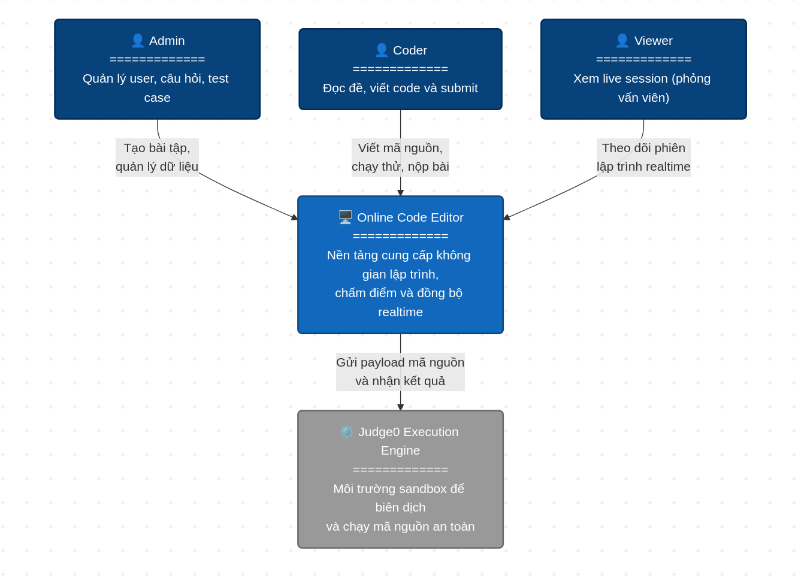
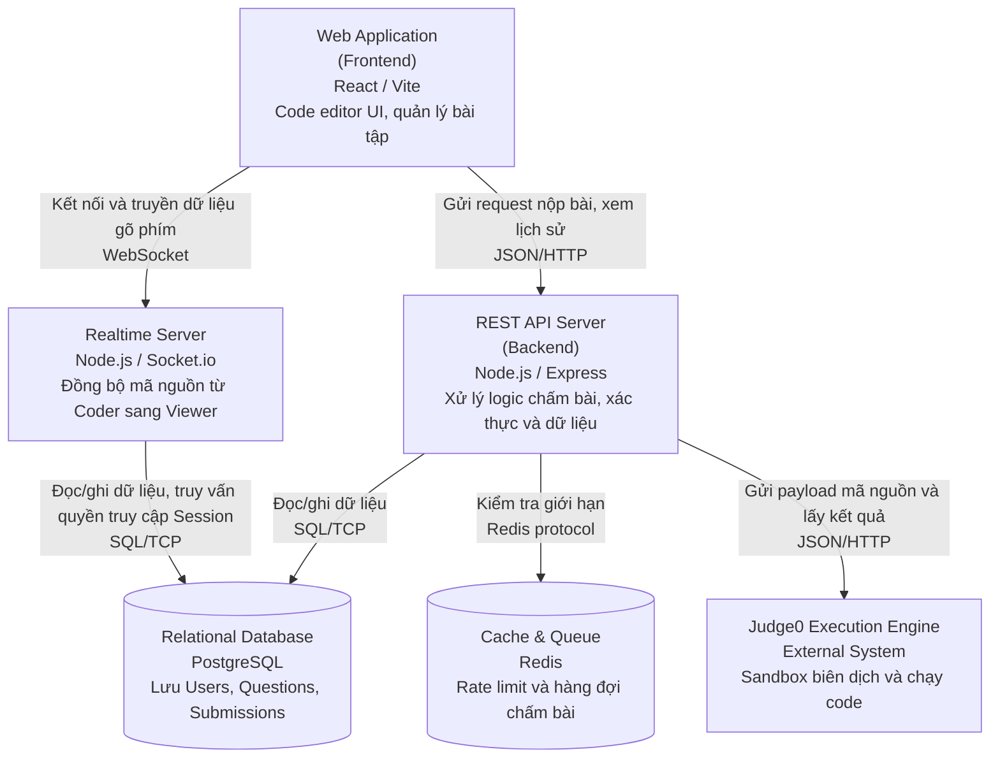
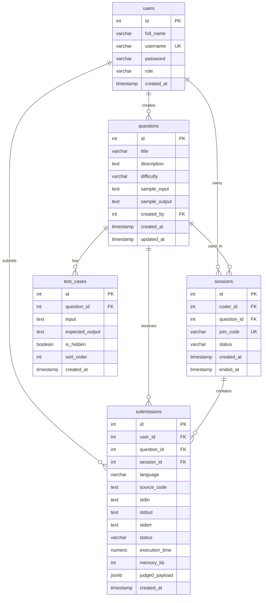

# Week 4 - High Level Design

Project: Online Code Editor tương tự LeetCode.

Mục tiêu tuần 4 là thiết kế kiến trúc tổng thể, database schema và các quyết định công nghệ chính trước khi bước sang Low Level Design/API spec ở tuần 5.

## 1. Design Scope

Tài liệu này tập trung vào High Level Design cho MVP:

1. Admin quản lý user, câu hỏi và test case.
2. Coder đọc đề, viết code, chạy thử và nộp bài.
3. Viewer theo dõi phiên lập trình realtime.
4. Backend gọi Judge0 để biên dịch/chạy code trong sandbox.
5. PostgreSQL lưu user, question, test case, submission và session.
6. Redis được đề xuất cho rate limit và queue khi hệ thống tăng tải.

Ngoài phạm vi HLD tuần 4:

1. Chi tiết request/response từng API.
2. Sequence diagram chi tiết cho từng flow.
3. Implement đầy đủ Judge0 client.
4. Realtime conflict resolution nhiều Coder cùng sửa một file.

Các phần trên sẽ được đưa vào Low Level Design ở tuần 5.

## 2. C4 Level 1 - System Context

Hình C4 Level 1 đã thiết kế:



### Mô tả

Online Code Editor là hệ thống trung tâm phục vụ ba nhóm người dùng chính:

| Actor | Vai trò | Tương tác với hệ thống |
| --- | --- | --- |
| Admin | Người quản trị | Tạo bài tập, quản lý user, quản lý câu hỏi và test case |
| Coder | Ứng viên/người làm bài | Đọc đề, viết mã nguồn, chạy thử, nộp bài |
| Viewer | Người phỏng vấn/người quan sát | Theo dõi phiên lập trình realtime, không chỉnh sửa code |
| Judge0 Execution Engine | External system | Nhận payload mã nguồn, biên dịch/chạy trong sandbox và trả kết quả |

### Luồng tổng quan

1. Admin tạo dữ liệu nền cho hệ thống gồm user, question và test case.
2. Coder chọn câu hỏi, viết code, chạy thử hoặc submit.
3. Online Code Editor gửi payload mã nguồn sang Judge0.
4. Judge0 trả về stdout, stderr, status, thời gian chạy và bộ nhớ sử dụng.
5. Viewer theo dõi realtime quá trình Coder làm bài trong session.

### Boundary hệ thống

Online Code Editor chịu trách nhiệm:

1. Authentication và authorization theo role.
2. Quản lý dữ liệu bài tập và bài nộp.
3. Điều phối request chạy code.
4. Lưu lịch sử submission.
5. Đồng bộ dữ liệu realtime từ Coder sang Viewer.

Judge0 chịu trách nhiệm:

1. Tạo môi trường sandbox.
2. Biên dịch và chạy mã nguồn.
3. Giới hạn tài nguyên CPU, memory và thời gian chạy.
4. Trả kết quả thực thi cho backend.

## 3. C4 Level 2 - Container Diagram

Hình C4 Level 2 đã thiết kế:


Ghi chú cập nhật: trong bản thiết kế hiện tại, dòng frontend được hiểu là `React + Vite`. VS Code là môi trường phát triển source code của dự án, không phải thư viện editor được nhúng trong web app.



### Các container chính

| Container | Công nghệ | Trách nhiệm |
| --- | --- | --- |
| Web Application | React, Vite | Cung cấp UI code editor, danh sách bài tập, form login/register, màn hình result |
| REST API Server | Node.js, Express | Xử lý auth, RBAC, question, test case, submission, session và tích hợp Judge0 |
| Realtime Server | Node.js, Socket.io | Đồng bộ code một chiều từ Coder sang Viewer trong session |
| Relational Database | PostgreSQL | Lưu users, questions, test_cases, submissions, sessions |
| Cache & Queue | Redis | Rate limit, chống spam run code, hàng đợi submission khi tải cao |
| Judge0 Execution Engine | Judge0 self-hosted | Biên dịch và chạy code trong sandbox |

### Giao tiếp giữa các container

| From | To | Protocol | Mục đích |
| --- | --- | --- | --- |
| Web Application | REST API Server | JSON/HTTP | Login, register, lấy câu hỏi, nộp bài, xem lịch sử |
| Web Application | Realtime Server | WebSocket | Gửi/nhận dữ liệu gõ phím trong session |
| REST API Server | PostgreSQL | SQL/TCP | Đọc/ghi dữ liệu nghiệp vụ |
| Realtime Server | PostgreSQL | SQL/TCP | Kiểm tra session, quyền truy cập, trạng thái session |
| REST API Server | Redis | Redis protocol | Rate limit, queue submission |
| REST API Server | Judge0 | JSON/HTTP | Gửi mã nguồn và nhận kết quả chạy code |

### Ghi chú kiến trúc

Trong MVP, REST API Server và Realtime Server có thể chạy cùng một Node.js process để giảm độ phức tạp triển khai. Khi hệ thống tăng tải, có thể tách Realtime Server thành service riêng vì đặc tính kết nối WebSocket lâu dài khác với REST request ngắn.

Redis là thành phần khuyến nghị. Nếu demo nhỏ, có thể chưa bật Redis và dùng rate limit trong memory. Tuy nhiên trong thiết kế HLD vẫn đưa Redis vào để thể hiện hướng mở rộng.

## 4. ERD - Database Design

ERD đề xuất cho MVP có 5 bảng chính:



## 5. Giải thích quan hệ bảng

### users

Lưu thông tin tài khoản và role. Role có ba giá trị chính:

1. `admin`: quản lý user, question, test case.
2. `coder`: làm bài, chạy code, submit.
3. `viewer`: xem session realtime.

Hiện tại repo đã có bảng `users` với cột `role` mặc định là `coder`.

### questions

Lưu ngân hàng câu hỏi lập trình. Mỗi question có thể do một Admin tạo thông qua `created_by`.

Quan hệ:

1. Một user Admin có thể tạo nhiều questions.
2. Một question có nhiều test cases.
3. Một question có nhiều submissions.
4. Một question có thể được dùng trong nhiều sessions.

### test_cases

Lưu input và expected output cho từng question.

`is_hidden = false` dùng làm sample/visible test case.

`is_hidden = true` dùng cho auto grading và không được trả expected output cho Coder/Viewer.

### sessions

Lưu phiên phỏng vấn/làm bài realtime. Mỗi session thuộc về một Coder và có thể gắn với một question.

`join_code` dùng để Viewer tham gia session. Code này cần unique và đủ khó đoán.

`status` nên có các giá trị: `active`, `ended`.

### submissions

Lưu lịch sử mỗi lần Coder run hoặc submit code.

Bảng này cần lưu code snapshot tại thời điểm chạy, vì source code có thể thay đổi sau đó. Nếu chỉ lưu latest code thì không thể debug hoặc xem lại lịch sử chính xác.

`judge0_payload` lưu raw response cần thiết từ Judge0 để phục vụ debug, nhưng không nên trả toàn bộ field này cho Coder nếu có dữ liệu nhạy cảm.

## 6. Normalize / Denormalize Decision

### Normalize

Thiết kế ưu tiên normalize ở các phần:

1. `users` tách khỏi `submissions` để tránh lặp thông tin user.
2. `questions` tách khỏi `test_cases` vì một câu hỏi có nhiều test case.
3. `sessions` tách khỏi `submissions` vì một session có thể có nhiều lần run/submit.

Lợi ích:

1. Giảm trùng lặp dữ liệu.
2. Dễ cập nhật question/test case.
3. Dễ enforce quyền truy cập theo user/session.

### Denormalize có chủ đích

`submissions.source_code`, `stdin`, `stdout`, `stderr`, `status`, `execution_time`, `memory_kb` được lưu trực tiếp trong bảng `submissions`.

Lý do:

1. Cần giữ snapshot kết quả tại thời điểm chạy.
2. Question hoặc test case có thể thay đổi sau khi user đã submit.
3. Admin/Coder cần xem lại lịch sử mà không phụ thuộc vào trạng thái hiện tại của editor.

## 7. Index đề xuất

| Index | Loại | Lý do |
| --- | --- | --- |
| `users(username)` | Unique index | Login nhanh và tránh trùng username |
| `users(role)` | Normal index | Admin filter user theo role |
| `questions(created_by)` | Normal index | Truy vấn câu hỏi theo người tạo |
| `questions(difficulty)` | Normal index | Filter question theo độ khó |
| `test_cases(question_id)` | Normal index | Lấy test case của question khi grading |
| `sessions(join_code)` | Unique index | Viewer join session nhanh và tránh trùng code |
| `sessions(coder_id, status)` | Composite index | Coder xem session active của mình |
| `submissions(user_id, created_at DESC)` | Composite index | Coder xem lịch sử của bản thân |
| `submissions(question_id, created_at DESC)` | Composite index | Admin lọc submission theo câu hỏi |
| `submissions(session_id, created_at DESC)` | Composite index | Viewer/Admin xem lịch sử trong session |
| `submissions(status)` | Normal index | Admin thống kê số bài accepted/error |

## 8. Tech Stack Decision Record

### Decision 1: React + Vite cho frontend, VS Code cho development

Chọn React + Vite vì repo hiện tại đã dùng stack này, tốc độ dev nhanh và dễ build Docker.

VS Code được dùng làm môi trường lập trình chính để phát triển source code của dự án. Trong MVP, giao diện web chỉ cần một code editor UI đủ để nhập mã nguồn, chọn ngôn ngữ, nhập stdin và xem output. Nếu chưa tích hợp thư viện editor riêng, có thể dùng textarea/editor component đơn giản trước để tập trung vào flow chạy code.

Trade-off:

1. Textarea/editor component đơn giản dễ làm demo nhưng thiếu syntax highlight mạnh.
2. Nếu sau này muốn trải nghiệm giống IDE hơn, có thể tích hợp editor library ở phase sau.
3. Cần xử lý readonly mode cho Viewer khi làm realtime.

### Decision 2: Node.js + Express cho backend

Chọn Express vì repo đã có cấu trúc module theo routes/controller/service/repository. Stack này đủ nhẹ cho MVP và dễ viết API nhanh.

Trade-off:

1. Express không ép architecture mạnh, cần giữ kỷ luật module.
2. Validation/error handling cần chuẩn hóa thêm ở LLD.

### Decision 3: PostgreSQL cho database

Chọn PostgreSQL vì dữ liệu có quan hệ rõ ràng: user, question, test case, submission, session.

Trade-off:

1. Cần migration rõ ràng khi schema tăng.
2. Query history lớn cần index và phân trang.

### Decision 4: Judge0 self-hosted cho execution

Chọn Judge0 vì compile/run code là phần rủi ro cao. Tự viết sandbox từ đầu rất khó đảm bảo an toàn.

Judge0 hỗ trợ nhiều ngôn ngữ, timeout, memory limit và cô lập môi trường chạy code.

Trade-off:

1. Judge0 là dependency ngoài, có thể down hoặc quá tải.
2. Cần map status Judge0 sang status chuẩn của hệ thống.
3. Cần retry/timeout/error handling thân thiện.

### Decision 5: Socket.io cho realtime

Chọn Socket.io vì dễ self-host, hỗ trợ reconnect và phù hợp flow Coder gửi code sang Viewer.

Trade-off:

1. WebSocket connection giữ lâu, cần tách scaling khác REST API.
2. Khi chạy nhiều instance cần adapter như Redis adapter.

### Decision 6: Redis cho rate limit và queue

Redis được đề xuất cho giai đoạn sau MVP hoặc demo nâng cao.

Vai trò:

1. Rate limit endpoint run/submit.
2. Queue submission khi Judge0 quá tải.
3. Socket.io adapter nếu scale realtime nhiều instance.

Trade-off:

1. Thêm một service cần vận hành.
2. MVP nhỏ có thể chưa cần bật ngay.

## 9. Scalability Analysis

### Bottleneck 1: Judge0 quá tải

Nguyên nhân:

1. Nhiều user bấm Run/Submit cùng lúc.
2. Code chạy lâu hoặc vòng lặp vô hạn.
3. Một số ngôn ngữ compile chậm hơn, ví dụ Java/C++.

Ảnh hưởng:

1. Request backend bị timeout.
2. User nhận kết quả chậm.
3. Queue Judge0 đầy, submission bị fail.

Mitigation:

1. Đặt timeout cho request từ backend sang Judge0.
2. Dùng rate limit theo user/IP.
3. Dùng Redis queue để giới hạn số job chạy đồng thời.
4. Cấu hình `cpu_time_limit`, `wall_time_limit`, `memory_limit`.
5. Trả lỗi thân thiện: "Code runner is temporarily unavailable."

### Bottleneck 2: PostgreSQL submissions/history tăng nhanh

Nguyên nhân:

1. Mỗi lần run code đều tạo một submission record.
2. Source code/stdout/stderr có thể dài.
3. Admin dashboard có thể filter nhiều chiều.

Ảnh hưởng:

1. Query history chậm.
2. Database storage tăng nhanh.
3. Backup/restore tốn thời gian hơn.

Mitigation:

1. Index theo `user_id`, `question_id`, `session_id`, `created_at`.
2. Luôn phân trang API history.
3. Giới hạn kích thước source code/stdout/stderr.
4. Có retention policy cho submission cũ nếu production thật.
5. Tách analytics/reporting khỏi bảng transaction nếu hệ thống lớn.

### Bottleneck 3: Realtime WebSocket nhiều Viewer

Nguyên nhân:

1. Một session có nhiều Viewer.
2. Coder gõ nhanh, phát nhiều event.
3. Nhiều session active cùng lúc.

Ảnh hưởng:

1. Realtime server dùng nhiều memory.
2. Network traffic tăng.
3. Viewer nhận update trễ.

Mitigation:

1. Debounce/throttle event từ frontend khoảng 300ms.
2. Chỉ gửi delta hoặc latest content cần thiết.
3. Giới hạn số Viewer/session trong MVP.
4. Khi scale nhiều instance, dùng Redis adapter cho Socket.io.

## 10. HLD Case Study

### Case 1: User A có đọc được file/code của User B không?

Theo thiết kế, User A không được đọc dữ liệu của User B nếu không có quyền phù hợp.

Ở tầng application:

1. Mọi API protected cần JWT hợp lệ.
2. Middleware `authenticateToken` xác định `req.user`.
3. Middleware `authorizeRoles` chặn các route chỉ dành cho Admin.
4. API lấy submission detail phải kiểm tra owner: `submission.user_id === req.user.id` hoặc `req.user.role === 'admin'`.
5. Viewer chỉ xem được session khi có `join_code` hợp lệ và session còn active.

Ở tầng database:

1. `submissions.user_id` liên kết với `users.id`.
2. Query history của Coder phải filter theo `WHERE user_id = current_user_id`.
3. Hidden test case không được expose cho Coder/Viewer.

Ở tầng execution:

1. Code của user không chạy trực tiếp trong backend container.
2. Backend chỉ gửi source code sang Judge0.
3. Judge0 chạy code trong sandbox riêng và trả kết quả.
4. User A không có quyền truy cập file/process của User B vì mỗi execution được cô lập bởi Judge0.

Rủi ro còn lại:

1. Bug ở API quên filter owner có thể làm lộ submission.
2. Log backend không được in token/password/source code nhạy cảm quá mức.
3. Join code yếu có thể bị đoán.

Mitigation:

1. Viết test authorization cho submission/session.
2. Join code phải random đủ dài.
3. Mask hidden test case output với Coder/Viewer.
4. Không trả `password`, token, raw secret qua API.

### Case 2: Judge0 down thì hệ thống làm gì?

Khi Judge0 down, hệ thống không được crash backend.

Luồng xử lý mong muốn:

1. Coder bấm Run/Submit.
2. Backend validate request.
3. Backend gọi Judge0 với timeout.
4. Nếu Judge0 timeout/connection refused/5xx, backend bắt lỗi.
5. Backend lưu submission với status `judge_error` hoặc `system_error`.
6. Backend trả response thân thiện cho frontend.
7. Frontend hiển thị lỗi hệ thống và cho phép retry.

Response đề xuất:

```json
{
  "error": {
    "code": "JUDGE0_UNAVAILABLE",
    "message": "Code runner is temporarily unavailable. Please retry later."
  }
}
```

Thiết kế không nên:

1. Không để process backend crash.
2. Không trả stack trace cho user.
3. Không retry vô hạn.
4. Không làm mất record submission nếu request đã hợp lệ.

Mitigation dài hạn:

1. Health check Judge0.
2. Circuit breaker khi Judge0 lỗi liên tục.
3. Redis queue để retry job khi Judge0 phục hồi.
4. Monitoring số lượng `judge_error`.

## 11. Schema Draft cần code trong tuần 4

Repo hiện tại đã có:

1. `users.role`.
2. Middleware `authorizeRoles`.
3. Bảng `questions`.
4. Bảng `test_cases`.
5. Index cơ bản cho `questions` và `test_cases`.

Nếu cần bổ sung code đúng trọng tâm tuần 4, chỉ nên draft thêm schema cho `sessions` và `submissions`, chưa cần viết full API.

Schema SQL đề xuất:

```sql
CREATE TABLE IF NOT EXISTS sessions (
  id SERIAL PRIMARY KEY,
  coder_id INTEGER NOT NULL REFERENCES users(id) ON DELETE CASCADE,
  question_id INTEGER REFERENCES questions(id) ON DELETE SET NULL,
  join_code VARCHAR(32) NOT NULL UNIQUE,
  status VARCHAR(20) NOT NULL DEFAULT 'active',
  created_at TIMESTAMP DEFAULT CURRENT_TIMESTAMP,
  ended_at TIMESTAMP,
  CONSTRAINT sessions_status_check CHECK (status IN ('active', 'ended'))
);

CREATE TABLE IF NOT EXISTS submissions (
  id SERIAL PRIMARY KEY,
  user_id INTEGER NOT NULL REFERENCES users(id) ON DELETE CASCADE,
  question_id INTEGER REFERENCES questions(id) ON DELETE SET NULL,
  session_id INTEGER REFERENCES sessions(id) ON DELETE SET NULL,
  language VARCHAR(50) NOT NULL,
  source_code TEXT NOT NULL,
  stdin TEXT,
  stdout TEXT,
  stderr TEXT,
  status VARCHAR(50) NOT NULL,
  execution_time NUMERIC(10, 3),
  memory_kb INTEGER,
  judge0_payload JSONB,
  created_at TIMESTAMP DEFAULT CURRENT_TIMESTAMP
);

CREATE INDEX IF NOT EXISTS sessions_coder_status_idx ON sessions(coder_id, status);
CREATE UNIQUE INDEX IF NOT EXISTS sessions_join_code_unique ON sessions(join_code);
CREATE INDEX IF NOT EXISTS submissions_user_created_idx ON submissions(user_id, created_at DESC);
CREATE INDEX IF NOT EXISTS submissions_question_created_idx ON submissions(question_id, created_at DESC);
CREATE INDEX IF NOT EXISTS submissions_session_created_idx ON submissions(session_id, created_at DESC);
CREATE INDEX IF NOT EXISTS submissions_status_idx ON submissions(status);
```

## 12. Mapping với code hiện tại

| Thành phần HLD | Trạng thái trong repo | Ghi chú |
| --- | --- | --- |
| React/Vite frontend | Đã có | `frontend/src` |
| Express REST API | Đã có | `backend/src/app.js` |
| PostgreSQL config | Đã có | `backend/src/config/db.js` |
| Auth/JWT | Đã có | `backend/src/modules/auth` |
| RBAC role | Đã có | `users.role` |
| `authorizeRoles` middleware | Đã có | `backend/src/middlewares/authorizeRoles.js` |
| Questions module | Đã có | `backend/src/modules/questions` |
| Test cases module | Đã có | `backend/src/modules/test-cases` |
| Submissions module | Chưa có | Dự kiến tuần 5-6 |
| Sessions/realtime | Chưa có | Dự kiến tuần 5-7 |
| Judge0 client | Chưa có | Dự kiến tuần 5-6 |
| Redis queue/rate limit | Chưa có | Optional sau MVP/demo |

## 13. Checklist cuối tuần 4

| Item | Done |
| --- | --- |
| Có C4 Level 1 | [x] |
| Có C4 Level 2 | [x] |
| Có ERD >= 5 bảng | [x] |
| Giải thích normalize/denormalize | [x] |
| Có tech decision record | [x] |
| Có scalability bottleneck | [x] |
| Có HLD case study isolation | [x] |
| Có HLD case study Judge0 down | [x] |
| Mentor review HLD | [ ] |

## 14. Câu hỏi cho mentor

1. MVP có bắt buộc dùng Redis queue ngay tuần 6 không, hay có thể dùng Judge0 `wait=true` cho demo trước?
2. Viewer có cần xem stdout/stderr realtime không, hay chỉ cần xem code realtime?
3. Hidden test case có cần mã hóa ở database không, hay chỉ cần kiểm soát API response?
4. Submission history cần lưu mọi lần Run hay chỉ lưu lần Submit/Grade?
5. Có cần tách REST API Server và Realtime Server thành hai service riêng trong Docker Compose không?
6. Giới hạn resource Judge0 nên đặt bao nhiêu cho demo: CPU time, wall time, memory?
