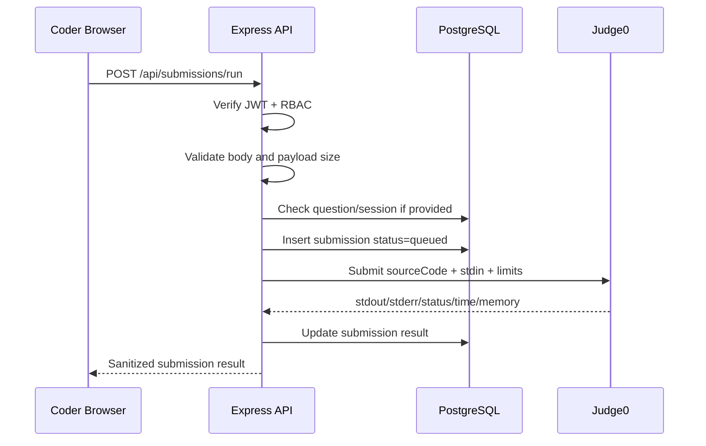
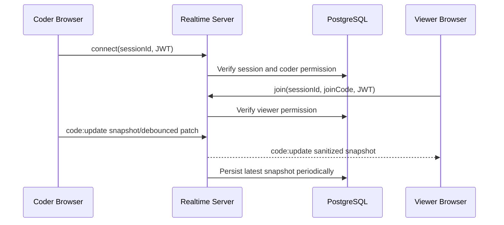

# Week 5 - Low Level Design

Project: Online Code Editor tương tự LeetCode.

Mục tiêu tuần 5 là chuyển High Level Design thành bản thiết kế có thể implement trực tiếp ở tuần 6. Tài liệu này tập trung vào API contract, request/response, RBAC, error handling, logging và security cho MVP.

## 1. MVP API Spec

Base URL local:

```text
http://localhost:3000/api
```

Authentication dùng JWT qua header:

```http
Authorization: Bearer <token>
```

### Auth

| Method | Endpoint | Role | Mục đích |
| --- | --- | --- | --- |
| POST | `/register` | Public | Tạo user mới, role mặc định `coder` |
| POST | `/login` | Public | Đăng nhập và nhận JWT |
| GET | `/me` | Authenticated | Lấy user hiện tại |

### Users

| Method | Endpoint | Role | Mục đích |
| --- | --- | --- | --- |
| GET | `/users` | Admin | Xem danh sách user |
| PATCH | `/users/:id/role` | Admin | Đổi role user |

### Questions

| Method | Endpoint | Role | Mục đích |
| --- | --- | --- | --- |
| GET | `/questions` | Admin, Coder, Viewer | Xem danh sách câu hỏi |
| GET | `/questions/:id` | Admin, Coder, Viewer | Xem chi tiết câu hỏi |
| POST | `/questions` | Admin | Tạo câu hỏi |
| PATCH | `/questions/:id` | Admin | Cập nhật câu hỏi |
| DELETE | `/questions/:id` | Admin | Xóa câu hỏi |

### Test Cases

| Method | Endpoint | Role | Mục đích |
| --- | --- | --- | --- |
| GET | `/questions/:id/test-cases` | Admin | Xem toàn bộ test case của một câu hỏi |
| POST | `/questions/:id/test-cases` | Admin | Tạo test case |
| PATCH | `/test-cases/:id` | Admin | Cập nhật test case |
| DELETE | `/test-cases/:id` | Admin | Xóa test case |

Ghi chú security: hidden test case chỉ được trả về ở Admin API. Coder/Viewer không có endpoint đọc expected output của hidden case.

### Submissions

| Method | Endpoint | Role | Mục đích |
| --- | --- | --- | --- |
| POST | `/submissions/run` | Admin, Coder | Chạy code với stdin tùy chọn |
| GET | `/submissions` | Admin, Coder | Xem lịch sử submission |
| GET | `/submissions/:id` | Admin, Coder | Xem chi tiết một submission |

MVP tuần 5 tạo skeleton endpoint. Tuần 6 sẽ nối Judge0 thật.

### Sessions / Realtime

| Method | Endpoint | Role | Mục đích |
| --- | --- | --- | --- |
| POST | `/sessions` | Coder | Tạo coding session |
| POST | `/sessions/join` | Viewer | Join session bằng join code |
| PATCH | `/sessions/:id/end` | Coder | Kết thúc session |
| WS | `/sessions/:id` | Coder, Viewer | Đồng bộ code realtime |

Sessions là contract thiết kế tuần 5. Nếu thiếu thời gian ở implementation, realtime có thể để tuần 7.

## 2. Request / Response Examples

### Register

```http
POST /api/register
Content-Type: application/json
```

```json
{
  "fullName": "Nguyen Van A",
  "username": "coder01",
  "password": "secret123"
}
```

```json
{
  "message": "User registered successfully",
  "user": {
    "id": 2,
    "fullName": "Nguyen Van A",
    "username": "coder01",
    "role": "coder"
  }
}
```

### Create Question

```http
POST /api/questions
Authorization: Bearer <admin_token>
Content-Type: application/json
```

```json
{
  "title": "Two Sum",
  "description": "Return indices of two numbers that add up to target.",
  "difficulty": "easy",
  "sampleInput": "nums = [2,7,11,15], target = 9",
  "sampleOutput": "[0,1]"
}
```

```json
{
  "message": "Question created successfully",
  "question": {
    "id": 1,
    "title": "Two Sum",
    "description": "Return indices of two numbers that add up to target.",
    "difficulty": "easy",
    "sample_input": "nums = [2,7,11,15], target = 9",
    "sample_output": "[0,1]",
    "created_by": 1
  }
}
```

### Create Test Case

```http
POST /api/questions/1/test-cases
Authorization: Bearer <admin_token>
Content-Type: application/json
```

```json
{
  "input": "nums = [2,7,11,15], target = 9",
  "expectedOutput": "[0,1]",
  "isHidden": false,
  "sortOrder": 0
}
```

```json
{
  "message": "Test case created successfully",
  "testCase": {
    "id": 1,
    "question_id": 1,
    "input": "nums = [2,7,11,15], target = 9",
    "expected_output": "[0,1]",
    "is_hidden": false,
    "sort_order": 0
  }
}
```

### Run Code

```http
POST /api/submissions/run
Authorization: Bearer <coder_token>
Content-Type: application/json
```

```json
{
  "questionId": 1,
  "sessionId": null,
  "language": "javascript",
  "sourceCode": "console.log('hello')",
  "stdin": ""
}
```

```json
{
  "message": "Submission skeleton created",
  "submission": {
    "id": 12,
    "user_id": 1,
    "question_id": 1,
    "session_id": null,
    "language": "javascript",
    "source_code": "console.log('hello')",
    "stdin": "",
    "stdout": null,
    "stderr": null,
    "status": "queued",
    "execution_time": null,
    "memory_kb": null,
    "created_at": "2026-07-27T02:00:00.000Z"
  }
}
```

Tuần 6 response sẽ đổi sang result thật từ Judge0, ví dụ `accepted`, `wrong_answer`, `compilation_error`, `runtime_error`, `time_limit_exceeded`.

## 3. Status Codes And Error Codes

| HTTP | Error code | Khi nào xảy ra |
| --- | --- | --- |
| 400 | `VALIDATION_ERROR` | Body thiếu field, id không hợp lệ, role không hợp lệ |
| 401 | `UNAUTHORIZED` | Thiếu hoặc sai JWT |
| 403 | `FORBIDDEN` | Role không được phép gọi endpoint |
| 404 | `QUESTION_NOT_FOUND` | Không tìm thấy question |
| 404 | `TEST_CASE_NOT_FOUND` | Không tìm thấy test case |
| 404 | `SUBMISSION_NOT_FOUND` | Không tìm thấy submission |
| 413 | `PAYLOAD_TOO_LARGE` | Source code hoặc stdin vượt giới hạn |
| 429 | `RATE_LIMITED` | User chạy code quá nhiều trong thời gian ngắn |
| 502 | `JUDGE0_UNAVAILABLE` | Judge0 timeout, connection refused hoặc lỗi upstream |
| 500 | `INTERNAL_ERROR` | Lỗi không mong muốn |

Response lỗi chuẩn:

```json
{
  "error": {
    "code": "VALIDATION_ERROR",
    "message": "Language and sourceCode are required"
  }
}
```

## 4. Sequence Diagrams

### Run Code



Tuần 5 skeleton dừng ở bước insert `queued`. Tuần 6 sẽ thêm Judge0 call và update result.

### Realtime Code Sync



## 5. RBAC Matrix

| Capability | Admin | Coder | Viewer |
| --- | --- | --- | --- |
| Register/login | Yes | Yes | Yes |
| List users | Yes | No | No |
| Change user role | Yes | No | No |
| Read questions | Yes | Yes | Yes |
| Create/update/delete questions | Yes | No | No |
| Read hidden test cases | Yes | No | No |
| Create/update/delete test cases | Yes | No | No |
| Run code | Yes | Yes | No |
| View own submissions | Yes | Yes | No |
| View all submissions | Yes | No | No |
| Create coding session | Optional | Yes | No |
| Watch realtime session | Yes | Optional | Yes |

## 6. Error Handling Strategy

1. Controller chỉ nhận `req/res/next`, gọi service và trả response.
2. Service validate input, tạo lỗi có `statusCode` và `code`.
3. Repository là layer duy nhất gọi database.
4. `errorHandler` trả response lỗi chuẩn `{ error: { code, message } }`.
5. Lỗi Judge0 được map sang lỗi thân thiện, không trả raw stack trace cho client.

## 7. Logging Strategy

Log nên có:

1. Method, path, status code, duration.
2. `userId` nếu request có JWT hợp lệ.
3. Submission id, language, question id, status.
4. Judge0 latency và normalized status.

Không log:

1. JWT token.
2. Password.
3. Full source code của user.
4. Hidden expected output.

## 8. Security Checklist

| Item | Thiết kế |
| --- | --- |
| JWT expiry | Token nên có hạn dùng; demo có thể ngắn hơn production |
| Input validation | Validate required fields, id, enum, source size, stdin size |
| SQL injection | Dùng parameterized query với `pg` |
| XSS output/source | Frontend render output/source bằng text/textarea/pre, không dùng HTML injection |
| Rate limit run code | MVP có thể in-memory; scale dùng Redis |
| Hidden test leakage | Không trả hidden test cases cho Coder/Viewer |
| Judge sandbox | Code chạy trong Judge0, không chạy trực tiếp trong API container |
| Payload size | Giới hạn source code và stdin trước khi gọi Judge0 |

## 9. Week 5 Implementation Checklist

| Item | Done |
| --- | --- |
| API spec có đầy đủ endpoint MVP | [x] |
| Có request/response example | [x] |
| Có >= 2 sequence diagrams | [x] |
| Có RBAC matrix | [x] |
| Có error/logging strategy | [x] |
| Có security checklist | [x] |
| Skeleton code khớp API spec | [x] |
